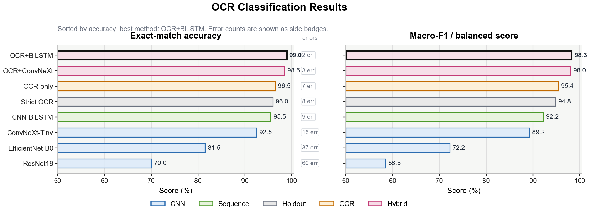
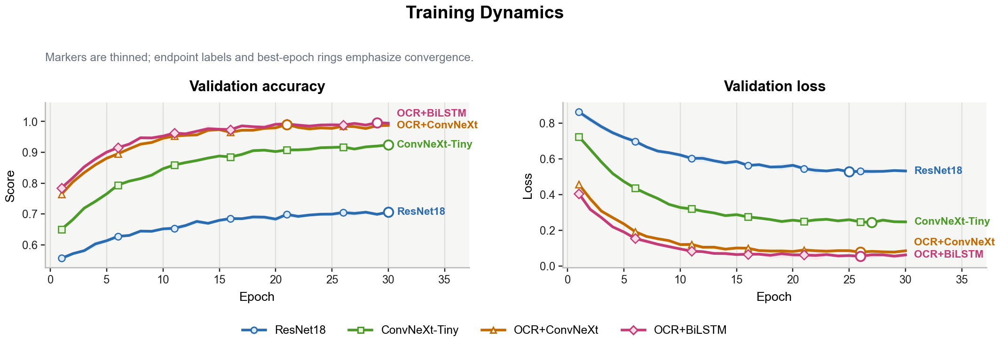
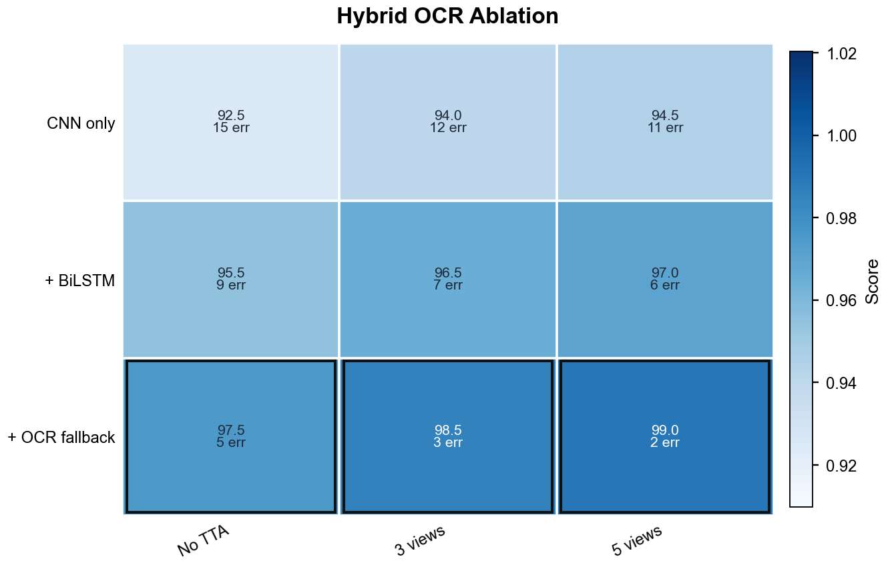
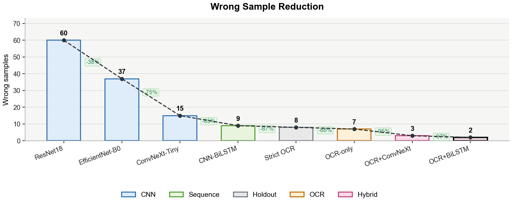

# Paper Python Plots

[English](README.en.md) · 把实验数据画成更像高水平论文结果图的 Python / Codex Skill


**Paper Python Plots** 是一个面向论文、课程大作业、毕业设计、实验报告、组会汇报和学术海报的绘图 skill。它帮助 Codex 先理解你的数据和科学结论，再选择合适图型，生成可复用 Python 绘图脚本，并导出 PDF/SVG/PNG 等可发表图件。

核心依赖保持轻量：**Matplotlib + NumPy + pandas**。如果本地已经安装 Seaborn、CMasher、Colorcet、SciencePlots 等库，skill 会把它们作为可选增强，但不会强制安装新依赖。

## 效果预览

下面图片全部由本仓库 demo 自动生成，不包含任何论文原图。

| 柱状图 | 神经网络分类报告 | 多色系 SEM | 训练曲线 |
|---|---|---|---|
|  |  |  |  |

| 消融表格热力图 | 错误减少链条 | Pareto 权衡 | 定性对比 |
|---|---|---|---|
|  |  |  |  |

## 适合什么场景

- 你有 CSV / Excel / pandas / NumPy 数据，想快速得到论文风格结果图。
- 你不确定该用柱状图、分布图、训练曲线、热图、Pareto 图还是多面板图。
- 你正在写神经网络、深度学习、OCR、分类识别、消融实验或课程大作业报告。
- 你希望图中有原始点、SEM/CI、错误数、直接标签、统一配色和矢量导出。
- 你想参考顶会论文结果图的布局、层级、配色和信息密度，但不复制任何论文原图。
- 你想复用 [figures4papers](https://github.com/ChenLiu-1996/figures4papers) 的高对比 manuscript house style，而不是复制其中的论文素材。

## 安装为 Codex Skill

推荐把仓库克隆到 Codex skills 目录：

```powershell
cd C:\Users\<你的用户名>\.codex\skills
git clone https://github.com/xyzxyq/paper-python-plots.git
```

如果你已经在其他位置下载了仓库，也可以复制整个目录到：

```text
C:\Users\<你的用户名>\.codex\skills\paper-python-plots
```

安装完成后，新开一个 Codex 对话，直接这样调用：

```text
Use $paper-python-plots to turn my dataset into a publication-ready Python figure.
```

命令行单独使用也可以：

```bash
python scripts/paper_plot.py --demo readme-gallery --out assets/gallery --formats png --dpi 220
python scripts/paper_plot.py --list-styles
python scripts/paper_plot.py --list-palettes
```

## 神经网络 / 分类 / OCR 报告专用风格

如果你的表格类似这样：

```csv
method,accuracy,macro_f1,wrong,family
ResNet18,0.700,0.585,60,CNN
ConvNeXt-Tiny,0.925,0.892,15,CNN
OCR+BiLSTM,0.990,0.983,2,Hybrid
```

优先使用 `nn_report`。它会避免长方法名挤在 x 轴上，改用横向 scoreboards、错误数徽标、分类 family 语义配色和更紧凑的论文式标题层级。

```bash
python scripts/paper_plot.py \
  --data paper_result_summary.csv \
  --kind classification-report \
  --group method \
  --value accuracy \
  --y macro_f1 \
  --error wrong \
  --series family \
  --style nn_report \
  --title "OCR Classification Results" \
  --out figures
```

错误减少图适合展示从 baseline 到 hybrid 的改进链条：

```bash
python scripts/paper_plot.py \
  --data paper_result_summary.csv \
  --kind error-reduction \
  --group method \
  --value wrong \
  --series family \
  --style nn_report \
  --title "Wrong Sample Reduction" \
  --out figures
```

训练曲线建议使用长表结构：`epoch, method, metric, value`。

```bash
python scripts/paper_plot.py \
  --data training_log.csv \
  --kind training-curves \
  --x epoch \
  --y value \
  --series method \
  --panel metric \
  --style nn_report \
  --title "Training Dynamics" \
  --out figures
```

消融矩阵建议使用：`component, setting, accuracy, wrong`。

```bash
python scripts/paper_plot.py \
  --data ablation.csv \
  --kind ablation-table \
  --series component \
  --x setting \
  --value accuracy \
  --error wrong \
  --style nn_report \
  --title "Hybrid OCR Ablation" \
  --out figures
```

## 如何写提示词

最推荐的提示词结构是：**数据位置 + 科学结论 + 图型/风格 + 导出要求**。

```text
Use $paper-python-plots.
我的数据在 results.xlsx。请根据 Method、Dataset、Score、SEM 画一张论文结果图。
目标结论是突出 Ours 在多个数据集上优于 baseline。
请使用默认柱状图风格，导出 PDF、SVG、PNG，并给我可复用的 Python 脚本。
```

如果是神经网络课程大作业或 OCR 分类实验：

```text
Use $paper-python-plots.
我的表格包含 method、accuracy、macro_f1、wrong、family。
请使用 nn_report 风格绘制分类方法对比图和错误减少图。
方法名较长，优先使用横向榜单，不要让标签旋转拥挤。
错误数请作为辅助徽标展示，不要塞进柱体里。
```

如果是训练过程：

```text
Use $paper-python-plots.
请绘制 nn_report 风格训练曲线。
不要每个 epoch 都打 marker，只保留少量关键 marker、末端方法标签和最佳 epoch 标记。
如果有重复实验，请加入浅色 CI ribbon。
```

如果你不知道该画什么图：

```text
Use $paper-python-plots.
请先检查 CSV 的列含义和数据结构，再决定最适合的论文图型。
优先展示原始数据或关键误差，不要为了好看隐藏样本分布。
```

## 按风格写提示词

| 目标 | 推荐提示词 |
|---|---|
| 默认柱状图 / benchmark 对比 | `请使用默认柱状图风格：浅灰面板、浅色填充、深色描边、误差棒、共享图例，适合论文 benchmark 结果。` |
| 神经网络分类报告 | `请使用 nn_report 风格，根据 method、accuracy、macro_f1、wrong、family 生成分类结果图，长方法名优先横向展示。` |
| Raw Points + SEM | `请画 Bar + Raw Points + SEM，保留原始点，使用浅填充 + 深描边色系，突出均值和 SEM。` |
| 分布图 | `请画高质量分布图，优先使用 raincloud / violin + box + raw points，展示样本量、均值或中位数。` |
| 训练曲线 | `请画顶会风格训练曲线，包含 mean curve、CI ribbon、少量 marker、末端直接标签和共享 legend。` |
| 消融实验 | `请画 nn_report 或 ICML-style ablation table，单元格显示数值和错误数/相对提升，最佳值加描边。` |
| Pareto 权衡 | `请画 Pareto trade-off 图，x 轴为成本/延迟，y 轴为性能，标出 Pareto frontier、重点方法和参数量气泡图例。` |
| 定性结果网格 | `请画 CVPR-style qualitative grid，按样例为行、方法为列，加入指标 badge、局部 zoom 或 callout。` |
| 地图/不确定性 | `请画 AAAI/geospatial-style uncertainty map，包含 prediction、uncertainty、residual 三个面板和紧凑 colorbar。` |
| figures4papers 风格 | `请使用 figures4papers house style：Helvetica/Arial 字体、蓝绿红语义配色、黑色柱边、直接数值、紧凑 y 轴和矢量导出。` |

## 图型与风格速查

| 参数 / 名称 | 适用场景 |
|---|---|
| `--demo bars` | 默认柱状图，适合 benchmark、方法对比、资源消耗。 |
| `--demo nn-report` | 神经网络/OCR/分类实验报告图，包括分类榜单、训练曲线、消融表和错误减少。 |
| `--demo sem-palettes` | 展示 Raw Points + SEM 的多色系配色。 |
| `--demo violin` | 分布图，展示 density、box、raw points。 |
| `--demo line` | 训练曲线 / 趋势图。 |
| `--demo pareto-scatter` | 性能-成本权衡图。 |
| `--demo ablation-matrix` | 消融矩阵 / 表格热力图。 |
| `--demo qual-grid` | 图像/结果定性对比。 |
| `--demo uncertainty-map` | 不确定性、残差、地图式结果图。 |
| `--demo figures4papers` | ChenLiu-1996/figures4papers 启发的 grouped bars、trend、heatmap、concept panel 综合示例。 |

| Style | 适合场景 |
|---|---|
| `nn_report` | 神经网络、深度学习、OCR、分类实验、训练曲线、错误减少和课程报告。 |
| `rl_benchmark` | 默认柱状图风格。名字保留用于兼容旧版本，对外可理解为 Bar Charts。 |
| `figures4papers` | figures4papers house style：高对比 sans 字体、语义蓝绿红配色、黑色柱边、紧凑多面板和矢量优先导出。 |
| `paper_showcase` | 通用顶会论文结果图审美。 |
| `cvpr_qualitative` | 定性结果网格、方法列、metric badge、zoom callout。 |
| `icml_dense` | 训练曲线、消融矩阵、metric suite、Pareto trade-off。 |
| `aaai_geo` | 地图式热图、不确定性图、遥感/社会影响类结果。 |
| `nature_minimal` | 克制、干净、偏期刊风格。 |
| `bio_stats` | 需要展示原始点和统计检验的实验数据图。 |

## 常用命令

生成完整 showcase：

```bash
python scripts/paper_plot.py --demo all --out paper_plot_demo
```

生成神经网络报告 demo：

```bash
python scripts/paper_plot.py --demo nn-report --out paper_plot_nn_report
```

从表格画默认柱状图：

```bash
python scripts/paper_plot.py \
  --data results.csv \
  --kind bar \
  --group Method \
  --value Score \
  --out figures
```

从表格画多面板 benchmark 柱状图：

```bash
python scripts/paper_plot.py \
  --data benchmark.csv \
  --kind rl-benchmark-grid \
  --panel Panel \
  --group Method \
  --value Score \
  --subtitle Subtitle \
  --orientation Orientation \
  --error Error \
  --display-value Display \
  --out figures
```

默认导出 `PDF + SVG + PNG`。如果只想导出 PNG：

```bash
python scripts/paper_plot.py --demo bars --out paper_plot_demo --formats png
```

## 数据列建议

- 分类/OCR 方法对比：`method`, `accuracy`, `macro_f1`, `wrong`, `family`。
- 训练曲线：`epoch` / `step`, `method`, `metric`, `value`。
- 消融表：`component`, `setting`, `accuracy`, 可选 `wrong`。
- 分组比较：`Group` / `Method` / `Condition` + `Value`。
- 带误差柱状图：`Method`, `Score`, `SEM` 或 `Error`。
- Pareto 图：`Method`, `Latency` / `Cost`, `Score`, 可选 `Params`。
- 多面板图：增加 `Panel`, `Subtitle`, `Orientation` 等列。

## 设计原则

- 图型服务科学结论，不为了装饰而换图。
- 方法名很长时优先横向展示，不把标签硬塞到 x 轴。
- 能展示原始点时尽量展示原始点；需要突出错误减少时直接展示错误数。
- 色彩使用浅填充 + 深描边，保证屏幕和打印都清晰。
- 文本、图例、误差棒、colorbar 不能裁切或重叠。
- 优先导出 PDF/SVG，PNG 作为预览或位图工作流。
- 不复制论文图，只学习布局、层级、配色和信息密度。

## 本地参考图缓存

如果需要构建本地参考图语料：

```bash
python scripts/collect_top_paper_figures.py --min-figures 20
```

缓存会写入 `research_cache/top_paper_figures/`，该目录已被 git 忽略。请不要公开原始论文 PDF、截取结果图、渲染页或 contact sheet。

## License

MIT License.
