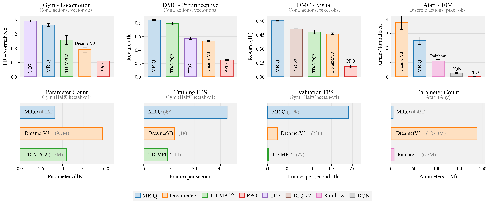
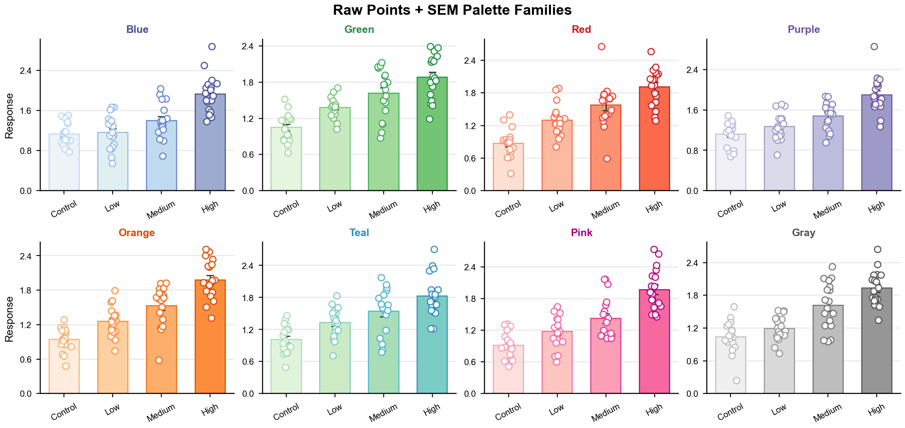
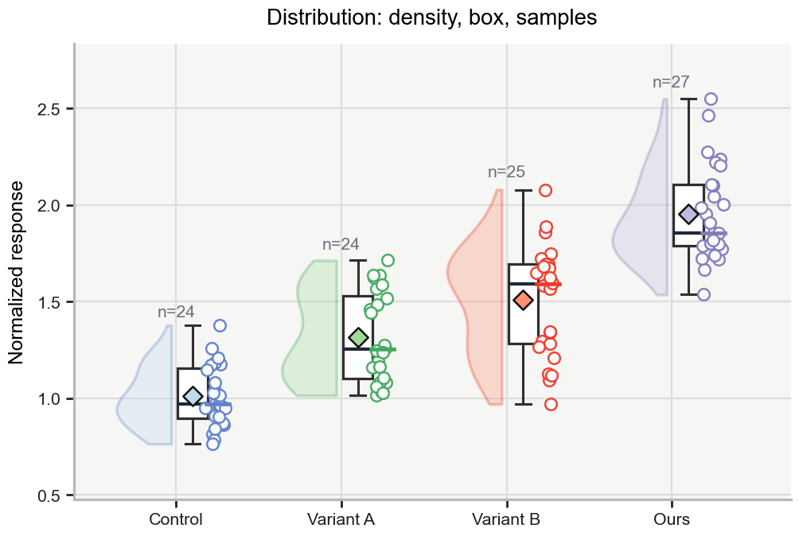
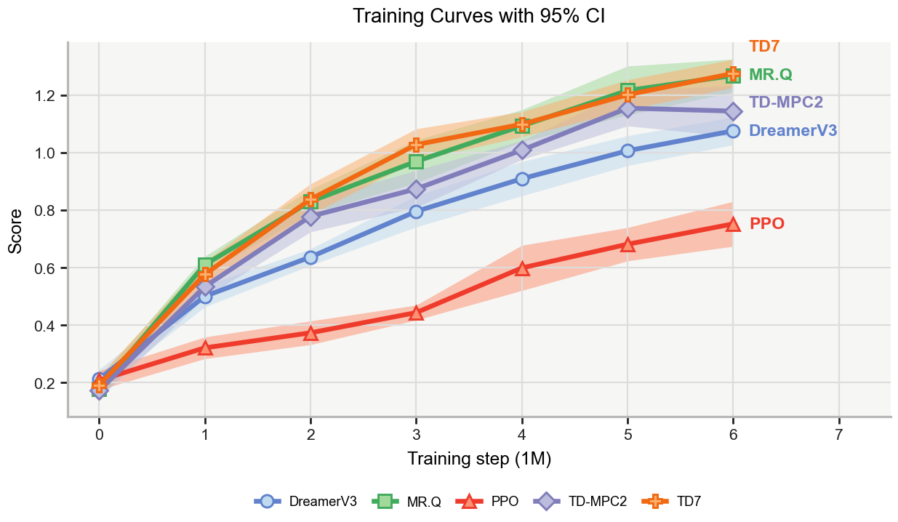
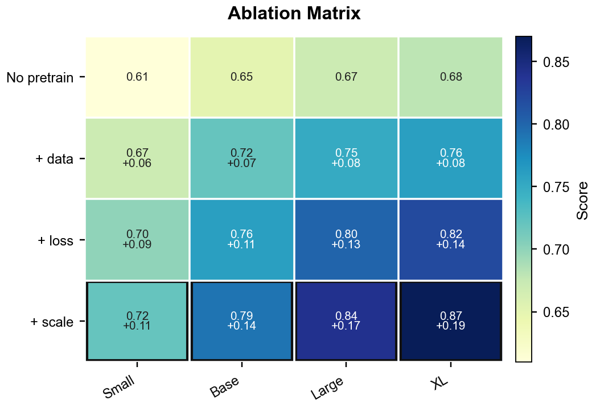
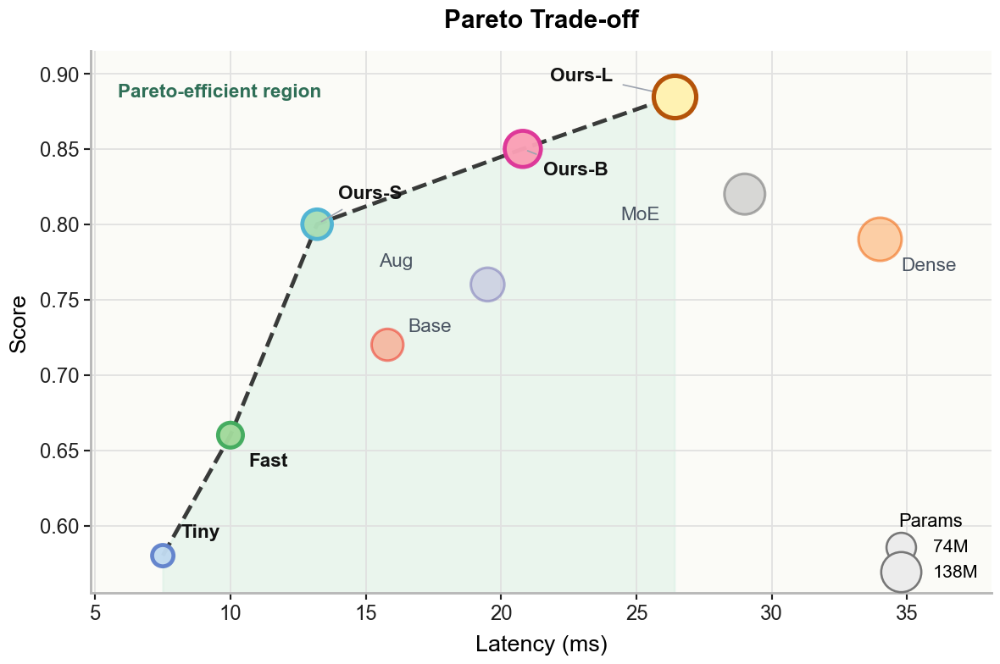
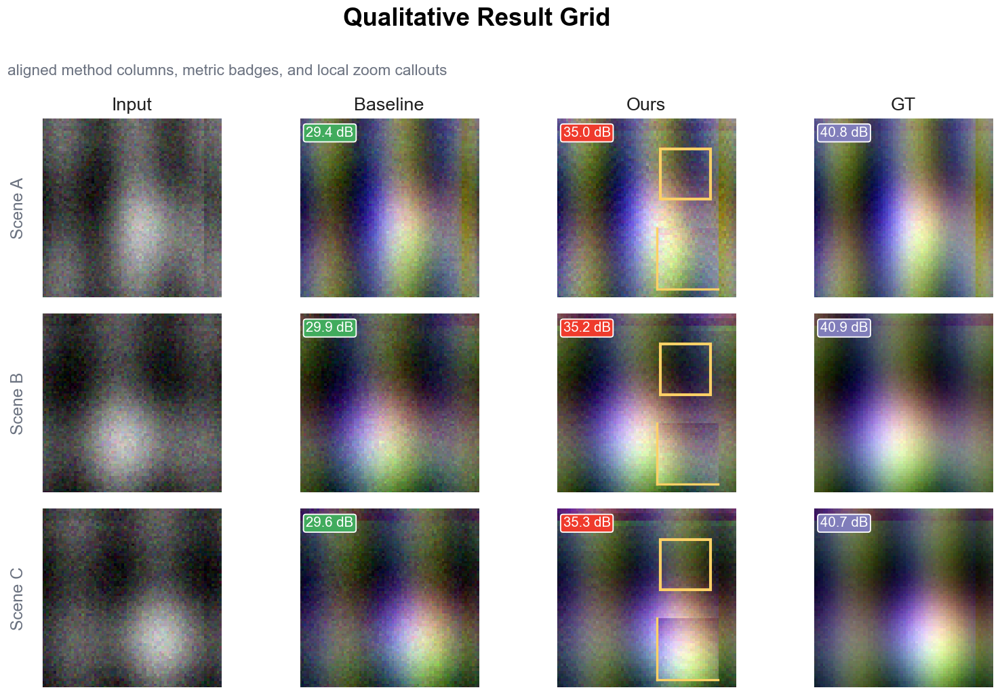
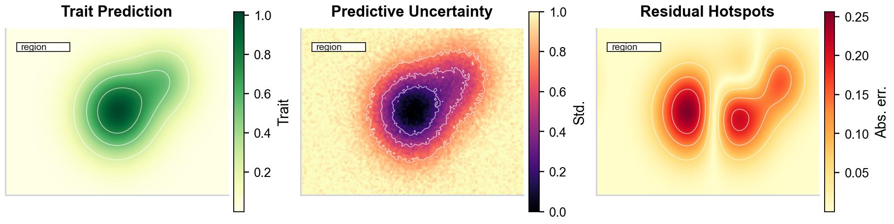

# Paper Python Plots

[English](README.en.md) · 面向论文、毕业设计、实验报告和学术海报的 Python 科研绘图 skill。


**Paper Python Plots** 用来把实验数据快速绘制成接近高水平论文结果图的 Python 图表。核心路径只强制依赖 Matplotlib、NumPy、pandas；如果本地安装了 Seaborn、CMasher、Colorcet、SciencePlots，也会自动使用它们提供更丰富的配色和风格增强。

它覆盖论文里最常见的结果图：柱状图、原始点 + SEM、训练曲线、分布图、消融矩阵、Pareto 权衡图、定性结果网格、不确定性地图、径向分布图和 3D sensitivity 图。

## 效果预览

下方图片全部由本仓库 demo 自动生成，不包含任何论文原图。

| 柱状图 | 多色系 SEM | 分布图 | 训练曲线 |
|---|---|---|---|
|  |  |  |  |

| 消融矩阵 | Pareto 权衡 | 定性对比 | 不确定性地图 |
|---|---|---|---|
|  |  |  |  |

## 为什么它更像论文图

- **默认柱状图采用 benchmark 论文风格**：浅灰面板、浅色填充、深色描边、误差棒、安全的柱内标签、横向资源条和方形色块图例。
- **保留浅填充 + 深描边配色**：适合分布图、折线图、散点图和多面板图，也保留了你提供截图里的配色启发。
- **内置顶会风格族**：支持 CVPR-style 定性网格、ICML-style 密集 dashboard、AAAI/geospatial-style 不确定性图和低层视觉对比图。
- **优先导出矢量文件**：默认保存 PDF/SVG，同时导出高 DPI PNG，并检查 PNG 是否为空白。
- **可选增强但不强制安装依赖**：本地有 Seaborn、CMasher、Colorcet 等库时自动暴露对应 palette，没有也能正常工作。

## 快速开始

生成完整 showcase：

```bash
python scripts/paper_plot.py --demo all --out paper_plot_demo
```

生成 README 预览图：

```bash
python scripts/paper_plot.py --demo readme-gallery --out assets/gallery --formats png --dpi 220
```

单独生成某类图：

```bash
python scripts/paper_plot.py --demo bars --out paper_plot_demo
python scripts/paper_plot.py --demo sem-palettes --out paper_plot_demo
python scripts/paper_plot.py --demo line --out paper_plot_demo
python scripts/paper_plot.py --demo ablation-matrix --out paper_plot_demo
python scripts/paper_plot.py --demo pareto-scatter --out paper_plot_demo
python scripts/paper_plot.py --demo uncertainty-map --out paper_plot_demo
```

查看可用风格和配色：

```bash
python scripts/paper_plot.py --list-styles
python scripts/paper_plot.py --list-palettes
```

## 绘制自己的数据

柱状图 / 原始点 + SEM：

```bash
python scripts/paper_plot.py \
  --data results.csv \
  --kind bar \
  --group Method \
  --value Score \
  --out figures
```

多面板 benchmark 柱状图：

```bash
python scripts/paper_plot.py \
  --data benchmark.csv \
  --kind rl-benchmark-grid \
  --panel Panel \
  --group Method \
  --value Score \
  --subtitle Subtitle \
  --orientation Orientation \
  --error Error \
  --display-value Display \
  --out figures
```

消融矩阵：

```bash
python scripts/paper_plot.py \
  --data ablation.csv \
  --kind ablation-matrix \
  --x Model \
  --series Component \
  --value Score \
  --out figures
```

默认导出 PDF、SVG、PNG；可以用 `--formats png` 只导出 PNG。

## 风格族

| 风格 | 适用场景 |
|---|---|
| `rl_benchmark` | 默认柱状图、benchmark 对比、参数/FPS/成本等资源图。对外文档统一称为 **Bar Charts / 柱状图**。 |
| `paper_showcase` | 通用顶会论文结果图审美。 |
| `cvpr_qualitative` | 图像/结果网格、方法列、指标 badge、局部 zoom。 |
| `icml_dense` | 消融实验、训练曲线、多指标 dashboard、Pareto 权衡图。 |
| `aaai_geo` | 地图式热图、不确定性结果、遥感/社会影响类图。 |
| `nature_minimal` | 更克制的期刊风格线稿。 |
| `bio_stats` | 需要展示原始数据点的统计图。 |

## 借鉴风格，不复制论文图

本项目参考了 SciencePlots、tueplots、CMasher、Colorcet、Matplotlib colormaps、Seaborn palettes、ColorBrewer、PyPalettes，以及近期顶会论文结果图的布局和配色规律。论文原图只允许保存在本地缓存，不会提交到 GitHub。

本地构建参考图缓存：

```bash
python scripts/collect_top_paper_figures.py --min-figures 20
```

缓存位于 `research_cache/top_paper_figures/`，已被 git 忽略。请不要公开原始论文 PDF、截取结果图、渲染页或 contact sheet。

## 作为 Codex Skill 使用

把本目录复制到 Codex skills 目录后，可以直接对 Codex 说：

```text
Use $paper-python-plots to turn my dataset into a publication-ready Python figure.
```

主说明在 `SKILL.md`；绘图配方、配色规则、设计笔记、来源链接和导出检查在 `references/`。

## License

MIT License.
